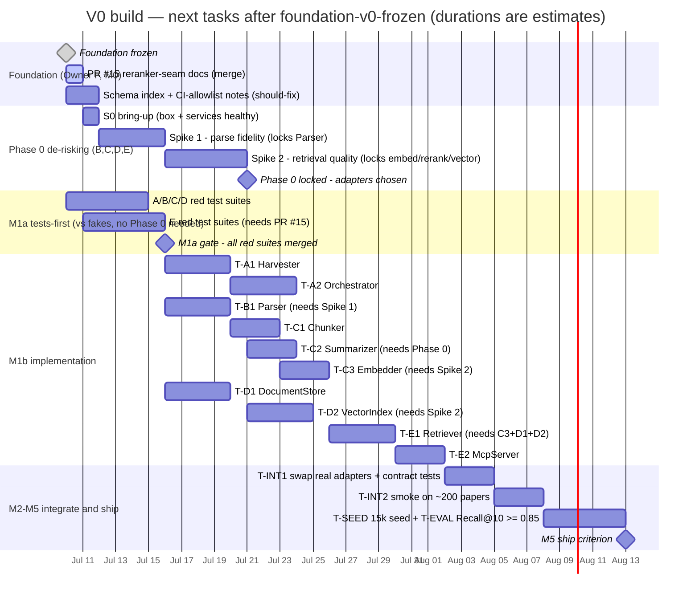

# SCHEDULE — V0 build plan after `foundation-v0-frozen`

The sequencing and gates for everything after Owner F's foundation freeze. This file is a **view** of two
sources of truth — `WORK-BREAKDOWN.md` (milestones + dependency graph) and `PHASE0-RUNBOOK.md` (spikes). If
this file ever disagrees with them, they win; update this view rather than forking the plan.

> **Durations in the Gantt below are estimates** — the design docs fix *ordering and gates*, not effort.
> The grid and dependency graph after it ignore time entirely and show only what blocks what; that part is
> authoritative.

## Status snapshot (2026-07-10)

- **M0 foundation (Owner F):** done — frozen at tag `foundation-v0-frozen`.
- **Open PRs:** #15 (reranker-seam doc fix) — gates Owner E's M1a start, awaiting review.
- **Should-fix before the fan-out** (from the foundation deep review): add the `blocks.paper_id` /
  `chunks.paper_id` index to `migrations/0001_init.sql`; add the CI-allowlist cross-reference note to the
  owner tickets (so `ci/checks/vendor_isolation.py` can't silently stop guarding once real vendors are
  chosen).

## Gantt — time-based (durations are estimates)



The Gantt does not render in a terminal — open this file on GitHub, or paste the block into
<https://mermaid.live>, to see the bars.

## Grid — owner x phase (ignores time)

Rows are owners, columns are build phases; each cell is that owner's tickets for that phase. `-` = nothing
in that phase.

| Owner | Modules | M0 foundation | Phase 0 | M1a — tests vs fakes | M1b — implementation | M2-M5 |
|---|---|---|---|---|---|---|
| **F** | Shared foundation | T-F1…T-F7 — frozen | - | - | - | - |
| **A** | Harvester, Orchestrator | - | - | A1, A2 red suites | T-A1 Harvester -> T-A2 Orchestrator | - |
| **B** | Parser | - | **Spike 1** (parse) | B1 red suite | T-B1 Parser | - |
| **C** | Chunker, Summarizer, Embedder | - | **Spike 2** (retrieval) | C1, C2, C3 red suites | T-C1 Chunker -> T-C2 Summarizer · T-C3 Embedder | - |
| **D** | DocumentStore, VectorIndex | - | **Spike 2** | D1, D2 red suites | T-D1 DocumentStore · T-D2 VectorIndex | - |
| **E** | Retriever, McpServer | - | **Spike 2** | E1, E2 red suites *(needs #15)* | T-E1 Retriever -> T-E2 McpServer | - |
| **all** | - | - | - | - | - | INT1 -> INT2 -> SEED + EVAL -> **ship** |

Two things the grid makes visible: (1) **M1a is fully parallel across A-E and needs no Phase 0** — the tests
run against the frozen interfaces + fakes; (2) only the real-adapter modules (B1, C2, C3, D2) block on the
Phase-0 spikes.

## Dependency order (ignores time — who blocks whom)

```
Owner F foundation ─────────────► everyone
Phase 0 (parser, embedder, reranker, config) ─► B1, C3, D2, E1
Parser(B1) ─► Chunker(C1) + Summarizer(C2) ─► Embedder(C3) ─► DocumentStore(D1)+VectorIndex(D2) ─► Retriever(E1) ─► McpServer(E2)
Harvester(A1) ─► Orchestrator(A2) ── wires all stages
Fakes(F4) let C1, C2, D1, E1, E2, A2 be built and tested BEFORE the real adapters exist.
```

Critical path: foundation -> Phase 0 -> DocumentStore(D1) + VectorIndex(D2) + Embedder(C3) -> Retriever(E1)
-> McpServer(E2) -> integration.

## Gates (must pass to advance)

- **Phase 0 lock** (PHASE0-RUNBOOK exit criteria) — parser + embedder + reranker + vector config locked with
  numbers; anchor round-trip >= ~95%; Recall@10 >= ~0.85; the ~200-question eval set committed;
  `phase0-results.md` records every number.
- **M1a -> M1b** — every module (M1-M9) has a committed, reviewed, **red** test suite; no implementation code
  exists yet; git history shows each test file's first commit predates its implementation file's.
- **M1b done** — each ticket's Definition of Done (CONVENTIONS §11) plus its acceptance criteria
  (WORK-BREAKDOWN M1b).
- **Foundation change** — any edit to `contracts/` / Config / schema / fakes needs the `foundation-change`
  label + `@MKamel1` sign-off before merge (T-F7).

## M1a test convention & the re-enable task

- M1a suites use **skip-until-implemented** (`pytest.importorskip("rag.<module>")`) so CI stays green while
  modules don't exist yet; each dormant file is tagged `# M1A-DORMANT (re-enable in M1b)`.
- **Standing task:** M1b's Definition of Done (CONVENTIONS §11) requires each suite to be un-skipped
  (`importorskip` resolves) and green before its module ticket is done — grep `M1A-DORMANT` to find every
  suite still awaiting re-enable.
- This was a deliberate choice to keep `main`'s CI a meaningful signal during the M1a→M1b window, vs.
  committing red-on-collection tests that would poison shared CI.

## Immediate next actions

1. **Merge PR #15** — unblocks Owner E's M1a.
2. **Batch the two should-fix items** (schema index, CI-allowlist note) while the schema is still under the
   freeze sign-off — cheapest it will ever be.
3. **Start S0 bring-up** — Phase 0's prerequisite; blocks both spikes.
4. **Owners A-D: start M1a test suites now** against the frozen interfaces + fakes. Owner E follows once #15
   lands.
