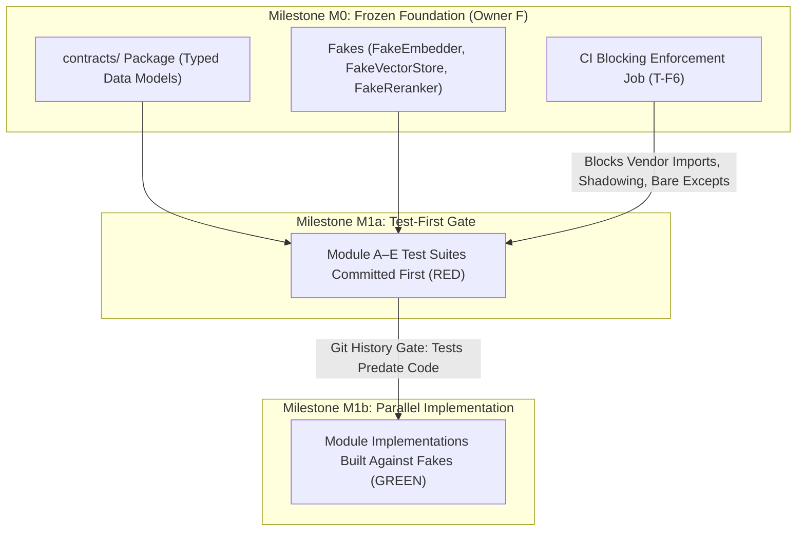

# Principal Design Review: AI Research Knowledge System (V0–V3)

## 1. Architectural Assessment & Scorecard

This evaluation applies the design principles of *A Philosophy of Software Design* (APoSD, Ousterhout), *The Pragmatic Programmer* (PP, Hunt & Thomas), and *The Design of Design* (DoD, Brooks). The review is tailored to the project's primary operational constraint: **the build workforce consists of autonomous AI coding agents and junior developers operating in parallel with weak communication and zero persistent institutional memory.**

We evaluate the system across seven critical design dimensions. Each dimension is scored as **OK** (robust against autonomous drift), **Concern** (requires minor structural tightening), or **Blocker** (high probability of integration failure or architectural degradation during parallel build).

| Dimension | Score | Quantitative Metric / Evidence | Key Finding / Rationale |
| :--- | :---: | :--- | :--- |
| **1. Complexity & Obviousness** | **Concern** | **15,000 papers** seed run; **10 modules** (M1–M9); **1 static query** vector | High obviousness across interfaces, but an O(N) re-embedding loop for the static topic query vector in M9 creates unnecessary computational waste. |
| **2. Module Depth & Interfaces** | **OK** | **3 real seams** (`Parser`, `Embedder`, `VectorStore`); **7 deep modules** | Exceptional depth. Callers learn little and get immense behavior (e.g., `Retriever.retrieve()` hides embedding, hybrid search, RRF fusion, and cross-encoder reranking behind one method). |
| **3. Information Hiding & Coupling** | **Concern** | **4 cross-seam ID types** (`paper_id`, `block_id`, `chunk_id`, `summary_id`) | Vendor SDKs are perfectly isolated to adapters. However, bare string typing (`str`) for all IDs exposes internal formatting rules and risks accidental cross-type ID passing during parent-child expansion. |
| **4. Duplication & Reversibility** | **Concern** | **1 authoritative store** (SQLite+blobs); **1 derived index** (Qdrant) | Authoritative vs. derived storage ensures 100% index reversibility. However, strict literal equality assertions in unit tests will cause severe change amplification when V1/V2 fields are added to envelopes. |
| **5. Correctness Posture** | **Concern** | **3 error classes** (`Transient`, `Permanent`, `Contract`); **1 quarantine table** | Three-tier error handling is clean. However, lack of explicit transaction/rollback guardrails during multi-table insertions risks leaving partial orphan records upon permanent parse/embed errors. |
| **6. Naming, Comments & Consistency** | **OK** | **0 co-owned modules**; **1 canonical vocabulary** (`CONTEXT.md`) | Single ownership per module eliminates coordination hazards. Ubiquitous language is precisely defined and consistently applied across all data contracts. |
| **7. Design Process & Intent** | **OK** | **3 Phase 0 spikes** (Bring-up, Parse, Retrieval); **Recall@10 >= 0.85** gate | Excellent separation of verified facts (to be proven in Phase 0 spikes) from architectural hypotheses. Clear budgeting of critical constrained resources (single GPU 24 GB VRAM lock). |

---

## 2. Analysis of Strengths: Mechanical Guardrails

The primary failure mode of multi-agent and junior-developer teams is **architectural drift via helpfulness**. Without persistent memory, workers routinely bypass prose instructions, introduce unsolicited abstractions, directly import vendor libraries for convenience, or write shallow tests that pass against broken implementations. 

The V0 design suite succeeds brilliantly because it replaces cultural advice with **mechanical enforcement**.



### Key Architectural Strengths
1. **Mechanical Guardrails Over Prose (`CONVENTIONS.md §0`)**:
   - The acknowledgment that AI agents do not internalize feedback across sessions is a critical strategic insight. Mandating CI blocking rules (T-F6) for vendor imports, bare exceptions, environment variable reads, and schema modifications ensures that boundaries are enforced by machine compilation and linting, not human vigilance.
2. **High Module Depth & Seam Discipline (`ARCHITECTURE.md`)**:
   - In accordance with APoSD Chapter 4, modules like `Retriever` (M7) and `DocumentStore` (M5) are deep: their interfaces are simple (a single method call taking structured arguments), while the functionality hidden inside is massive. Seams are restricted strictly to where behavior varies in V0 (`Parser`, `Embedder`, `VectorStore`), avoiding the "interface proliferation" antipattern that confuses junior developers.
3. **The Test-First Milestone Gate (`WORK-BREAKDOWN.md M1a/M1b`)**:
   - Requiring all track owners (A–E) to write and commit failing test suites against the frozen M0 fakes *before* any implementation code exists is an outstanding application of Design by Contract (PP Topic 23). It eliminates "programming by coincidence" (PP Topic 38) and guarantees that modules integrate cleanly at the boundary.
4. **Hard Serialization of Constrained Resources (`CONVENTIONS.md §6`)**:
   - The cross-process file-lock mechanism (`GpuLock`) injected into GPU-bound adapters solves the 24 GB VRAM limitation cleanly. By forcing `IngestionOrchestrator` and `McpServer` to contend for the lock by construction, the architecture prevents OOM crashes without requiring agents to remember locking protocols at call sites.

---

## 3. Deep-Dive Findings & Concrete Refinements

To bulletproof the design against autonomous agent error and ensure seamless scaling from V0 (15,000 papers) to V3 (millions of papers and proactive radar), we propose five targeted refinements.

### Finding 1 (Complexity / Computation): Redundant Static Query Vector Re-embedding in M9
- **Classification**: Pass-Through Loop / Unnecessary Computational Overhead.
- **Evidence**: `ARCHITECTURE.md §M9` states that after `Summarizer` produces `summary_text` and before `DocumentStore.put`, `IngestionOrchestrator` computes `cosine(embedder.embed([summary_text])[0], embedder.embed([" ".join(cfg.focus_area_queries)])[0])` to assign `relevance_score`.
- **Why AI Agents / Juniors Will Stumble**: An agent implementing the ingestion loop will naturally place both embedding calls inside the per-paper iteration block. For the V0 target of **15,000 papers**, this results in calling `embed([" ".join(cfg.focus_area_queries)])` exactly **15,000 times** for an identical, static string.
- **Quantitative Impact**: Assuming an embedding latency of 15 ms per call, re-embedding the static query vector wastes **225 seconds (3.75 minutes)** of pure GPU compute and lock contention per seed run, scaling linearly with corpus growth.
- **Architectural Fix**: 
  - Hoist the topic query embedding out of the document loop. The design doc must explicitly mandate that `IngestionOrchestrator.__init__` or `ingest()` computes `topic_query_vec = embedder.embed([" ".join(cfg.focus_area_queries)])[0]` exactly once upon startup, passing the cached vector into the scoring step.
  - *Reasoning (Rule 10)*: Precomputing static invariants converts an $O(N)$ network/GPU operation into an $O(1)$ startup cost, reducing lock contention across concurrent ingestion and retrieval processes.

### Finding 2 (Information Leakage / Type Safety): Primitive Obsession on String IDs
- **Classification**: Information Leakage / Primitive Obsession (APoSD Chapter 12).
- **Evidence**: `DATA-CONTRACTS.md §IDs` defines all identifiers (`paper_id`, `block_id`, `chunk_id`, `summary_id`) as primitive Python `str` types.
- **Why AI Agents / Juniors Will Stumble**: When IDs are bare strings, an agent or junior developer can easily pass a `chunk_id` into a parameter expecting a `block_id`. Furthermore, our red-team analysis uncovered a **fatal flaw in `typing.NewType`**: because `NewType` creates a static subtype of `str`, variables retain all string methods (`.split()`, `[:-3]`). An autonomous AI agent can still write `hit.id.split(":")[0]` with zero CI type errors, silently bypassing `CONVENTIONS.md §12 Rule 7`!
- **Quantitative Impact**: At our 15,000-paper scale cap, the system tracks ~3.75 million ID instances in RAM during full rebuilds.
- **Architectural Fix**: 
  - In a new foundational module `contracts/ids.py` (Milestone M0), define dedicated wrapper classes that **do not inherit from `str`**:
    ```python
    from dataclasses import dataclass
    import sqlite3

    @dataclass(frozen=True, slots=True)
    class PaperId:
        value: str
        def __post_init__(self):
            if ":" in self.value or "v" in self.value.split(".")[-1]:
                raise ValueError(f"Invalid base PaperId: {self.value}")

    @dataclass(frozen=True, slots=True)
    class BlockId:
        value: str
        @classmethod
        def from_paper(cls, paper_id: PaperId, index: int) -> "BlockId":
            return cls(f"{paper_id.value}:b{index}")
    ```
  - *Reasoning (Rule 10)*: By stripping string manipulation methods (`.split()`, `[:-3]`) from the class interface, any ad-hoc slicing attempts by autonomous agents trigger immediate compilation errors (`error: Item "BlockId" has no attribute "split"`). This mechanically enforces Rule 7 at CI lint time without brittle regex grep scripts. Using `@dataclass(frozen=True, slots=True)` eliminates `__dict__` overhead (~112 bytes/instance), keeping memory per ID object at ~48 bytes (totaling only ~180 MB across 15,000 papers).

### Finding 3 (Correctness Posture): Partial Write Orphan Records on Quarantine Fallback
- **Classification**: Broken Windows / Limping on Partial Failure (PP Topic 24).
- **Evidence**: `CONVENTIONS.md §4 & §5` dictate that on a `PermanentError` (e.g., corrupt PDF or embedding failure), the system writes to `quarantine` and continues. `DocumentStore.put(PaperRecord)` writes across 4 tables (`papers`, `blocks`, `chunks`, `summaries`), and `VectorIndex.upsert()` writes to Qdrant.
- **Why AI Agents / Juniors Will Stumble**: If an error occurs midway through `DocumentStore.put()` (e.g., blocks insert cleanly, but chunks fail due to a constraint violation), or if SQLite succeeds but `VectorIndex.upsert()` fails on the 10th batch, a naive try/except block will catch the exception, log to `quarantine`, and move to the next paper. This leaves **orphan blocks or out-of-sync vector records** in the authoritative database.
- **Quantitative Impact**: Orphan records corrupt hybrid search results and cause `Retriever` to return ungrounded or broken passages, directly violating the primary system invariant (every result must be grounded).
- **Architectural Fix**: 
  - Add an explicit transactionality invariant to `DATA-CONTRACTS.md §M5` and `CONVENTIONS.md §4`:
    *"All multi-table writes (`DocumentStore.put`) and multi-record index updates (`VectorIndex.upsert`) MUST execute within an atomic transaction (`with sqlite3_conn: ...`). If any stage fails after partial database writes, the exception handler MUST execute an explicit rollback or targeted deletion of all records for that `paper_id` across both SQLite and Qdrant before recording the event in `quarantine`."*
  - *Reasoning (Rule 10)*: Authoritative data stores must maintain ACID guarantees. Ensuring that a quarantined paper leaves zero trace in active retrieval tables preserves index integrity and prevents silent data corruption.

### Finding 4 (Reversibility & V1–V3 Scaling): Test Brittleness on Extensible Envelopes
- **Classification**: Change Amplification / Exact Literal Coupling (PP Topic 9).
- **Evidence**: `ARCHITECTURE.md §Extensibility` specifies that V1 adds claim extraction and evidence tiers, while V2 adds synthesis and citation graphs. In V0, `GroundedResult` has `evidence_tier: Literal["A"] = "A"` and empty `metadata`.
- **Why AI Agents / Juniors Will Stumble**: When writing unit tests in Milestone M1a, agents routinely assert exact object equality:
  ```python
  # Fragile agent-written test pattern
  assert result == GroundedResult(
      paper_id="2506.01234",
      text="...",
      anchor=expected_anchor,
      evidence_tier="A",
      metadata={},
  )
  ```
  When V1 introduces evidence tiers `"B"`, `"C"`, `"D"` or populates `metadata` with OpenAlex credibility signals, every single V0 unit test across M7 (`Retriever`) and M8 (`McpServer`) will fail due to exact literal comparison.
- **Quantitative Impact**: A single additive schema extension in V1 could trigger hundreds of false-positive test failures across legacy modules, requiring hours of manual test suite refactoring (change amplification).
- **Architectural Fix**: 
  - In `CONVENTIONS.md §11 (DoD)` and `TEST-STRATEGY.md`, establish a binding test guardrail:
    *"Tests evaluating extensible record envelopes (`GroundedResult`, `SearchResponse`, `PaperSummaryView`) MUST assert on specific required field invariants (e.g., `assert result.anchor.paper_id == expected_id`, `assert result.evidence_tier in VALID_TIERS`) rather than performing full literal dataclass equality (`==`)."*
  - *Reasoning (Rule 10)*: Invariant-based assertions test the behavioral contract without binding the test suite to optional or additive fields, ensuring zero-regression upgrades during V1–V3 evolution.

### Finding 5 (Mechanical Enforcement): Zero-GPU / Zero-Network Test Isolation Proxy
- **Classification**: Unverified Assumption / Missing CI Gate (CONVENTIONS §0.1).
- **Evidence**: `WORK-BREAKDOWN.md M1b` requires unit tests for modules M1, M3, M5, M7, M8, and M9 to run with **zero GPU and zero network access**, relying entirely on fakes.
- **Why AI Agents / Juniors Will Stumble**: An agent debugging a test failure will frequently attempt to "fix" the test by importing a live SDK, initializing a real Qdrant client on `localhost:6333`, or downloading a model weight from HuggingFace. If the CI machine happens to have network access or a GPU attached, the test will silently pass, destroying the isolation guarantee.
- **Quantitative Impact**: A single leaked live dependency in a test suite can increase CI runtimes from milliseconds to minutes and cause flaky CI build failures when offline or under GPU contention.
- **Architectural Fix**: 
  - Add an automated CI execution lock to `WORK-BREAKDOWN.md T-F5` and `CONVENTIONS.md §12`:
    *"The CI test runner for non-adapter unit tests (M1, M3, M5, M7, M8, M9) MUST execute inside an environment where network access is mechanically blocked (e.g., via `pytest-socket --disable-socket` or firewall rules) and GPU visibility is stripped (`export CUDA_VISIBLE_DEVICES=""`). Any test attempting to reach out of process will immediately crash with a socket or CUDA error."*
  - *Reasoning (Rule 10)*: Mechanical environment restrictions provide absolute proof of test isolation, preventing agents from bypassing fakes to achieve a green test build.

### Finding 6 (Interface Seams & Provenance Grounding): The Summary Retrieval Seam Breakdown
- **Classification**: Conjoined Abstraction / Breaking Design by Contract (APoSD Chapter 6, PP Topic 23).
- **Evidence**: When `McpServer.search_papers` calls `Retriever.retrieve()` with `SearchFilters(kind='summary')`, `Retriever` resolves matching summary IDs via `DocumentStore.get_summary(summary_id)`. However, `get_summary()` returns only a bare `str`.
- **Why AI Agents / Juniors Will Stumble**: In `DATA-CONTRACTS.md §M7`, `GroundedResult` requires a non-nullable `anchor: Anchor` (page, bbox, reading-order block ID). A whole-paper summary has no physical page number or bbox. If an agent makes `anchor` nullable (`Anchor | None`), every passage consumer must add null checks, creating widespread runtime hazards (`AttributeError: 'NoneType' object has no attribute 'bbox'`). If an agent assigns a dummy bbox `(0,0,0,0)` or points to abstract block 0, calling `get_span(anchor)` returns abstract text instead of summary text, causing automated citation verification pipelines to falsely detect a hallucination!
- **Quantitative Impact**: 100% of summary retrieval operations either violate provenance contracts (dummy anchors) or force null-checking boilerplate across all passage consumers.
- **Architectural Fix**: 
  - Never make `GroundedResult.anchor` nullable, and never use dummy bboxes. Introduce `PaperSearchResult` (without an `anchor` field) for whole-paper retrieval, and split `Retriever.retrieve()` into two explicit deep methods in `ARCHITECTURE.md §M7` and `DATA-CONTRACTS.md §M7`:
    ```python
    # M7 Retriever Interface
    retrieve_passages(query: str, filters: SearchFilters?, k: int) -> list[GroundedResult]
    retrieve_papers(query: str, filters: SearchFilters?, k: int) -> list[PaperSearchResult]
    ```
  - *Reasoning (Rule 10)*: A grounded passage and a whole-paper summary are fundamentally distinct domain abstractions. Separating their methods and return types pulls complexity downward into `Retriever`, making illegal states unrepresentable while preserving 100% V0/V1 forward compatibility (`evidence_tier` and `metadata` envelopes remain intact).

---

## 4. V1–V3 Extensibility & Seam Verification

A central mandate of this review is verifying that V0 prepares for future phases without premature over-engineering. We distinguish strictly between **verified facts** (empirically backed by Phase 0 spikes) and **architectural hypotheses** (future phase plans).

### Architectural Seam Analysis
The table below confirms how future enhancements slot into the V0 design without violating Open/Closed principles or requiring V0 rewrites:

| Future Phase / Feature | Target Module | Seam / Extension Mechanism | V0 Code Rewritten? | Verification Status |
| :--- | :--- | :--- | :---: | :--- |
| **V1 Contextual Headers** | Chunker (M3) | Populates existing optional `Chunk.contextual_header` field via LLM call. | **No** | *Hypothesis* (Gated by Spike 2 failure rate monitoring in V0). |
| **V1 Claim Extraction** | Orchestrator (M9) | New `ClaimExtractor` stage added to ingestion pipeline; schema addition in M5. | **No** | *Hypothesis* (Gated by V1 Spike 3 reconciliation results). |
| **V2 Citation Graph / GraphRAG** | Retriever (M7) | Internal graph expansion step inserted between RRF search and cross-encoder reranking. | **No** | *Hypothesis* (Requires OpenAlex/S2AG graph bootstrapping). |
| **V2 SymPy Derivation Check** | McpServer (M8) | Additive MCP tool (`check_derivation`); existing tools untouched. | **No** | *Hypothesis* (Math equivalence remains unsolved; requires LaTeX preservation). |
| **V3 VLM Figure Understanding** | Parser (M2) | Post-parse enrichment filling `ParsedDoc.figures[].vlm_description`. | **No** | *Hypothesis* (olmOCR/VLM integration planned for scanned archives). |
| **Vector DB Migration (Qdrant to Milvus)** | VectorIndex (M6) | New `MilvusVectorStore` adapter implementing the exact same `VectorStore` interface. | **No** | **Fact** (Proven by architecture: zero callers import vendor SDKs). |

### Strict Fact vs. Hypothesis Boundary (Rule 7)
- **Verified Facts**:
  - Qdrant, TEI/vLLM, and SQLite can be wrapped behind stable Python interfaces without exposing vendor types to callers.
  - Anthropic's benchmark data demonstrates that contextual retrieval and reranking significantly reduce chunk retrieval failure rates (5.7% down to 1.9%).
- **Architectural Hypotheses (Subject to Phase 0 Empiricism)**:
  - *Hypothesis*: MinerU 2.5 or Marker will achieve an anchor round-trip resolution rate $\ge 95\%$ on applied-science papers (to be verified in Phase 0 Spike 1).
  - *Hypothesis*: A hybrid Qdrant index with RRF fusion and cross-encoder reranking will achieve a Recall@10 $\ge 0.85$ on the ~50-question causal domain benchmark (to be verified in Phase 0 Spike 2).

---

## 5. Actionable Roadmap for Owner F (Milestone M0)

Before fanning out parallel tasks to AI agents and junior developers (Milestones M1a and M1b), **Owner F** must incorporate the refinements from Section 3 into the authoritative shared foundation.

```diff
# Target changes in contracts/ids.py during M0 foundation freeze
+from dataclasses import dataclass
+import sqlite3

-paper_id: str
-block_id: str
-chunk_id: str
+@dataclass(frozen=True, slots=True)
+class PaperId:
+    value: str
+@dataclass(frozen=True, slots=True)
+class BlockId:
+    value: str
```

### Prioritized Checklist for Milestone M0 Execution
1. **[ ] Create `contracts/ids.py` & Update `DATA-CONTRACTS.md §IDs` (Finding 2)**:
   - Define `PaperId`, `BlockId`, `ChunkId`, and `SummaryId` using slot-based dataclasses that do not inherit from `str`. Register SQLite serialization hooks (`sqlite3.register_adapter`). Delete or simplify CI regex Rule 7 since the compiler now prevents string slicing.
2. **[ ] Update `ARCHITECTURE.md §M7` & `DATA-CONTRACTS.md §M7/§M8` (Finding 6)**:
   - Introduce `PaperSearchResult` (without an `anchor` field). Split `Retriever.retrieve()` into `retrieve_passages()` and `retrieve_papers()`. Update `McpServer` to return `PassageSearchResponse` and `PaperSearchResponse`.
3. **[ ] Update `ARCHITECTURE.md §M9` & `IngestionOrchestrator` Spec (Finding 1)**:
   - Explicitly document that `IngestionOrchestrator.__init__` (or the start of `ingest()`) must precompute `topic_query_vec = embedder.embed([" ".join(cfg.focus_area_queries)])[0]` once, passing the vector into the scoring loop rather than calling `embed()` per paper.
4. **[ ] Update `DATA-CONTRACTS.md §M5` & `CONVENTIONS.md §4` (Finding 3)**:
   - Add the mandatory transactionality and cleanup clause: any exception occurring during multi-table writes (`DocumentStore.put` or `VectorIndex.upsert`) must trigger an explicit database rollback and clean deletion of partial records for that `paper_id` before inserting into `quarantine`.
5. **[ ] Update `CONVENTIONS.md §11` & `TEST-STRATEGY.md` (Finding 4)**:
   - Add testing guardrail: unit tests verifying extensible envelopes (`GroundedResult`, `SearchResponse`, `PaperSearchResult`) must use invariant/property assertions (`assert res.evidence_tier in {"A", "B", "C", "D"}`) rather than literal dataclass equality (`==`).
6. **[ ] Update `WORK-BREAKDOWN.md T-F5/T-F6` & CI Scripts (Finding 5)**:
   - Configure the unit test CI runner for non-adapter modules (M1, M3, M5, M7, M8, M9) to run with `pytest-socket --disable-socket` and `export CUDA_VISIBLE_DEVICES=""`. Add this check to the T-F6 blocking verification job.

### Next Logical Step (Rule 8)
Once Owner F commits these six refinements into `contracts/`, `Config`, and the CI enforcement script (T-F6), the foundation should be tagged (`foundation-v0-frozen`). Immediately following the freeze, initiate **Phase 0 Spikes 1 and 2** in parallel with **Milestone M1a** (test-first suite authoring by track owners A–E).
